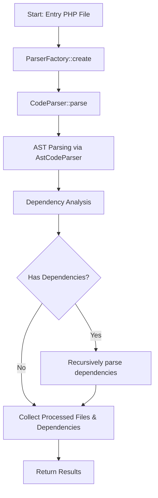

# Workflow of PHP Packer Parser

## Explanation

- The parser is created via `ParserFactory::create` with entry file and options.
- `CodeParser::parse` is called for the entry file.
- The file is parsed to AST, then dependencies are analyzed.
- Each dependency is recursively parsed.
- The process collects all parsed files and their dependencies.
- Results can be accessed via `getProcessedFiles()` and `getDependencies()`.
